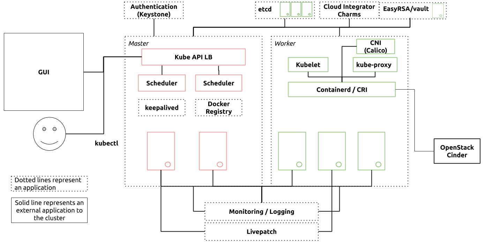

# Kubernetes Low Level design

## Introduction

Kubernetes is a container orchestration solution originally designed and open sourced by Google. It allows running containers of different kinds (Docker, rkt, containerd) at scale, with interesting properties such as self healing, service discovery and autoscaling. 
The Charmed Kubernetes (CK) offers a solution as close as possible to the upstream version of Kubernetes.
The goal of this document is to describe a deployment design of Kubernetes CNTT requirements compliant environment. Kubernetes is assumed to be deployed on-top of a compliant substrate using Juju. The compliant substrate list include:
- Openstack
- GCP
- AWS

This document contains design details pertaining to:
1. **Design Overview**. The Design Overview provides a high level presentation that describes the Kubernetes deployment strategy, architecture, and overall design characteristics.
2. **Charm Bundle**. The Charm Bundle is a YAML file that describes the complete model of the deployed cloud as code. This file can be used to build and rebuild your cloud at any time. 

As stated in [chapter 03](https://github.com/cntt-n/CNTT/blob/master/doc/ref_arch/kubernetes/chapters/chapter03.md) of CNTT Kubernetes reference architecture this document describes two NFVI software profiles:

## Technologies

### Ubuntu Server
All elements are deployed within virtual machines running Ubuntu Server operating system. Ubuntu Server is the operating system developed by Canonical for servers and cloud and is the base platform for the whole deployment. Ubuntu is a Linux based operating system with commercial support and follows release cycle available at https://www.ubuntu.com/about/release-cycle.

### Juju
Juju is a service modeling software implemented as a distributed system. It uses a model description as an input and delivers an environment according to a set of requirements defined in the model. It is also used to manage the lifecycle of services in a given model.

Juju consists of a number of components:
- Controller nodes (physical or virtual) which hosts API and database components of Juju;
  - Controllers include a machine provider-specific provisioning logic dependant on an underlaying substrate.
- Juju client which is used to bootstrap and manage Juju itself and models provisioned via Juju;
- Machine agents are used to perform post-deployment machine-related tasks that are relevant for Juju operation and report to Juju controller nodes;
- Unit agents execute application lifecycle events. The concrete application-specific logic is encoded in Charms.

A detailed Juju documentation can be found at https://jaas.ai/. 

### Charms
Charms encode the operational knowledge about a particular application in a reusable way. The operational knowledge in question is about deployment, scaling, upgrades, post-deployment reconfiguration, setting up software in a highly available configuration, integrations with other applications etc.

Charms rely on Juju to provide them with a platform for distributed and event-driven code execution, data exchange and a data model for common operations. However, the specifics of how to use that platform for a particular application are outside of Juju and are implemented in concrete charms.

The generic approach to operations taken in Juju and Charms makes Charms an exceptional tool not only in deploying and operating simple applications like load balancers or web servers but also complex applications such as OpenStack or Kubernetes.

Most of the software deployment in this engagement will be done using Juju and Charms. All charms that will be used in this project are open source and available at https://jujucharms.com.

You can find the  charmed distribution of Kubernetes bundle at https://github.com/charmed-kubernetes/bundle. 

### Charmed Kubernetes

The release cycle of the Charmed Kubernetes (CK) is tightly synchronized to the release of upstream Kubernetes®. The current version and two prior releases are supported, giving an effective support period of nine months, subject to changes in the upstream release cycle. Up-to-date information about Ubuntu and CK  support periods is available at https://www.ubuntu.com/about/release-cycle. 

## Substrate Configuration

### Infrastructure flavors

The following tables describe the minimum requirements for the VIM flavors, that will support the CNTT compliant K8s cluster, for both Basic and Network Intensive profiles.

#### Basic Profile

| **Flavor** | **CPU** | **RAM** | **DISK** | **NUMA** | **Hugepages** | **CPU Pinning**| **IPSec Acceleration** | **Crypto Acceleration** |
| :--- | :---: | :---: | :---: | :---: | :---: | :---: | :---: | ---: |
| lma-node | 8 | 16GB | 500GB | - | - | - | - | - |
| k8s-control-node | 8 | 16GB | 500GB | - | - | - | - | - |
| K8s-worker | 32 | 64GB | 500GB | No | No | No | No | No |

#### Network Intensive Profile

| **Flavor** | **CPU** | **RAM** | **DISK** | **NUMA** | **Hugepages** | **CPU Pinning**| **IPSec Acceleration** | **Crypto Acceleration** |
| :--- | :---: | :---: | :---: | :---: | :---: | :---: | :---: | ---: |
| lma-node | 8 | 16GB | 500GB | - | - | - | - | - |
| k8s-control-node | 8 | 16GB | 500GB | - | - | - | - | - |
| K8s-worker | 32 | 64GB | 500GB | Yes | Yes | Yes | Optional | Optional |
#### VNI Specs

These flavor should be extended so that each interface bandwidth can be customized.
Note that this is not part of the base flavor.

| Virtual Network Interface Option   | Interface Bandwidth               |
|------------------------------------|-----------------------------------|
| n1, n2, n3, n4, n5, n6             | 1, 2, 3, 4, 5, 6 Gbps             |
| n10, n20, n30, n40, n50, n60       | 10, 20, 30, 40, 50, 60 Gbps       |
| n25, n50, n75, n100, n125, n150    | 25, 50, 75, 100, 125, 150 Gbps    |
| n50, n100, n150, n200, n250, n300  | 50, 100, 150, 200, 250, 300 Gbps  |
| n100, n200, n300, n400, n500, n600 | 100, 200, 300, 400, 500, 600 Gbps |

(This means that each instance needs 6 interfaces?)

### Infrastructure roles

The following table describes the deployment roles, flavors and minimum node counts for each role. 

|  **Role** | **Co-located K8s Services** | **# Nodes** | **Instance Flavor** |
| :--- | :--- | :---: | :--- |
|  **LMA Nodes** | Juju Controller, Nagios, Graylog, Prometheus | 3 |  |
|  **Control Nodes** | k8s master, etcd, easyrsa, kubeapi load balancer | 3 |  |
|  **Worker Nodes** | k8s worker  | 6 |  |

### Infrastructure networking

XXX: TBD networking desingn
- required openstack networks   
- DNS support
- NTP
- Proxy support

### Kubernetes Storage

#### Cluster machines
Each provisioned Kubernetes worker has local storage on the physical server which can be used by the containers running on that worker. However, this is not replicated storage and containers redeployed onto a different worker node will lose access to any data they may have saved to this local storage. As such it is recommended that clustered storage is used for all persistent data.

#### Containers
Kubernetes cluster will be integrated with the Cinder CSI plugin to attain persistent volumes for containers. This process requires the enablement of some features gates such as CSIDriverRegistry and CSINodeInfo.

## Juju

Juju is deployed in high-available mode, with 3 controller units acting as an active-active cluster.

## Kubernetes deployment

### Architecture

The following describes a logical architecture diagram of a single Kubernetes cluster: 

The Charmed Kubernetes solution has a variety of components with the target of achieving high availability, namely, keepalived, two master nodes and three etcd nodes, Charmed Kubernetes uses ceph as it’s storage pool with authentication provided by keystone to kubernetes-master.
The optional components of this cluster can be removed or added via juju relations in charms, for example the container runtime can be changed for Docker or combined with containerd to suite the use case.

### Networking

Kubernetes will use the Calico CNI plugin to implement the cluster networking. The choice of Calico is primarily to enable the NetworkPolicy feature of Kubernetes. NetworkPolicy objects are similar in purpose to Security Groups in virtual environments like OpenStack or AWS.

### ETCD setup

Etcd is a highly available distributed key value store used as Kubernetes’ backing store for all cluster data, providing a reliable way to store data across a cluster of machines. Etcd gracefully handles master elections during network partitions and will tolerate machine failure, including the master.

### Encryption

EasyRSA is utilised in the bootstrap phase of the cluster in order to provide certs and enable communication between the cluster and etcd. Once Etcd cluster is bootstrapped with EasyRSA, other safestores such as Vault can interact with this Etcd cluster.

### Kubernetes master

The kubernetes-master charm is an encapsulation of the Kubernetes master processes and the operations to run on any cloud for the entire lifecycle of the cluster.

This charm has resources, which are supplied to it, the resources used by this charm are snap packages such as kube-apiserver, kube-controller-manager, kube-proxy, kube-scheduler and kubectl.

HashiCorp's Vault can be used to provide either a root or intermediate CA. It can also be deployed HA, as well as provide a secure secrets store which can be used to enable encryption-at-rest for Charmed Kubernetes.
Vault does require an additional database to store its data and (depending on configuration) some manual steps will be required after deployment or any reboot so that secrets, such as certificates and signing keys, can be accessed.

### Kubernetes worker

The kubernetes-worker charm deploys a container runtime, and additionally stands up the Kubernetes worker applications: kubelet, and kube-proxy.
Although Docker is still supported, containerd is now the default container runtime in Charmed Kubernetes. Containerd brings significant performance improvements and prepares the way for Charmed Kubernetes integration with Kata in the future.
Container runtime code has been moved out of the kubernetes-worker charm, and into subordinate charms one for each runtime, This allows the operator to swap the container runtime as desired, and even mix container runtimes within a cluster. It also allows for additional container runtimes to be supported in the future.

### Ingress

## Logging and Monitoring

The solution Logging, Alerting and Monitoring (LMA) Stack offers cluster metrics collection and cluster logs collection. It will be deployed using several software components installed into different, dedicated cloud instances.

## Identity and Authorization

## RBAC

Using role-based access control, access is granted to users based on the roles assigned to them. This mode expects respective roles and bindings to be available for any running services. CK already has roles and bindings ready for use.
Many of the defined roles (those prefixed by 'system:' ) for RBAC are really intended for managing access to Kubernetes components themselves.
The main cluster roles for additional users are: admin, cluster-admin, edit and view.
The recommended method for managing Kubernetes users is through an external authentication service such as LDAP. 

## Keystone

CK can be configured to use Keystone and LDAP for authentication only or both authentication (who a user is) and authorization (what a user is allowed to do).
By default, CK will setup Keystone only for authentication to allow the flexibility of using other methods such as Kubernetes RBAC for authorization. 

## Security

### Overview

Kubernetes today includes many security features that are categorized and described below: 

- **RBAC**: Role-based access control gives user the ability to restrict access to resources within Kubernetes to certain users or groups within the cluster. 
- **Namespaces**: Namespaces provide a way to segregate resources in Kubernetes. They are essentially virtual Kubernetes clusters. For example, in a single cluster, user can isolate resources by creating namespaces such as dev, test, and prod. 
- **Secrets**: Secrets are namespace specific base64 encoded strings which can be used to store API keys and other sensitive data for our workloads. 
- **Pod Security Policies**: Pod security policies allow user to define the specific capabilities of pods, with regard to to resources and permissions/access. 
- **Network Policies**: Network policies provide the ability to create ingress or egress rules on the Kubernetes overlay network to limit pod-to-pod communication.   

### Control Plane TLS Termination

The components of Charmed Kubernetes® (CK) need to be able to communicate securely over the network. This is accomplished using TLS and public-key encryption with a chain of trust up to a shared root Certificate Authority (CA). However, when the cluster is being brought up or a new unit is being added, the chain of trust and certificates required must be bootstrapped into the machines somehow.
All communication between Juju units and the Juju controller happens over TLS-encrypted websockets. The certificate for the TLS connection to the controller is added as explicitly trusted to each machine as part of the bootstrap process using a combination of cloud-init and SSH.
With this secure channel, Juju charms can communicate with each other using relation data. The data published by one unit is sent to the controller, which then makes it available for all other units on the same relation. The data for each relation is scoped by ID and is only visible to units participating in the specific relation on which it is set. However, it is worth noting that relation data is stored on the controller machine in MongoDB,so for truly sensitive information, proper secret storage engines, such as Vault, and encryption-at-rest should be used.

### Encryption at rest

Kubernetes has the concept of secrets for managing sensitive information needed by a cluster, such as usernames and passwords, encryption keys, etc. Secrets can be managed independently of the pod(s) which need them and can be made available to the pods that require them as needed.
By default, the secret data is stored in plaintext in etcd. Kubernetes does support encryption at rest for the data in etcd, but the key for that encryption is stored in plaintext in the config file on the master nodes. To protect this key at rest, CK uses HashiCorp's Vault and VaultLocker to securely generate, share, and configure the encryption key used by Kubernetes.

## Reliability

## Architecture Component Details

|  **Type** | **Component** | **Version** |
| :--- | :--- | :--- |
|  OS | Ubuntu | 20.04 LTS (kernel v. 5) |
|  Deployment Orchestration | Juju | 2.7 |
|  Container Platform | Kubernetes | 1.17 |
|  Container format | docker | n/a |
|  Container runtime | containerd | 2001.2.6 |
|  Kubernetes key-value store | etcd | 2003.2.10 |
|  Secrets Management (during boot-straping) | easy-rsa | 3.0.1 |
|  Secrets Management | vault | 2001.1.1 |
|  Networking (CNI plugin) | Calico | Calico 3.6.1 |
|  Storage (CSI plugin) | cinder/ceph | Cinder 12.0.7 Ceph 12.2.12 |
|  Monitoring Stack | apache2 elasticsearch filebeat graylog grafana mongodb prometheus telegraf nagios nrpe-host | Apache2 2.4.29 Elasticsearch 6.8.3 Filebeat 6.8.3 Graylog 3.0.1 Grafana 5.0.0 Mongodb 3.6.3 Prometheus 2.8.1 Telegraf 1.12.1 Nagios 3.5.1 Nrpe 3.2.1 |
|  High availability of Kubernetes master & etcd nodes | keepalived | 2001.3.9 |